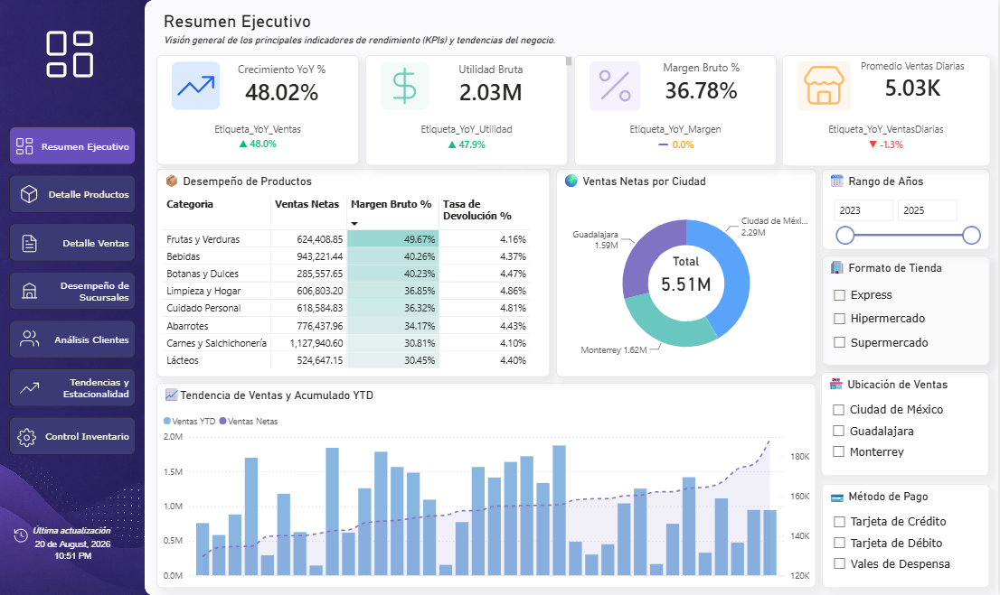
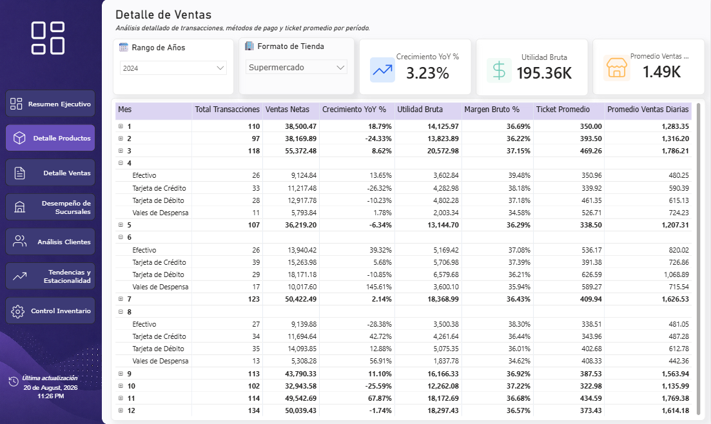

# 📊 Retail Executive Dashboard — Power BI

> **An executive-level retail analytics dashboard built in Microsoft Power BI, focused on sales performance, profitability, trends, and actionable business insights.**

This project demonstrates how Power BI can be used to transform retail data into an interactive executive reporting solution.

The dashboard combines **data modeling, DAX, time intelligence, interactive navigation, KPI design, and professional report layout** to provide a clean business-facing analytics experience.

---

## 🖥️ Dashboard Preview

### Executive Dashboard



---

## 🎯 Project Objective

The goal of this project was to build a **practical retail executive dashboard** that allows business users to quickly understand overall performance and drill into the factors driving sales and profitability.

The dashboard is designed around questions such as:

* How is the business performing overall?
* What are the current sales and profit trends?
* Which products and categories are performing best?
* Which regions or segments are contributing the most?
* How is performance changing over time?
* Where are potential performance issues or opportunities?

---

## 📌 Key Features

### Executive KPIs

The dashboard provides high-level performance indicators designed for quick executive review, including:

* Sales
* Profit
* Quantity
* Profit Margin
* Performance trends
* Comparative business metrics

### 📈 Trend Analysis

Time-based analysis helps identify:

* Sales trends
* Profit trends
* Growth patterns
* Period-over-period performance
* Seasonal changes

### 🛍️ Product & Category Analysis

Users can analyze performance across different:

* Products
* Categories
* Sub-categories
* Product groups

### 🌎 Business Segmentation

Interactive analysis allows performance to be explored across relevant business dimensions such as:

* Region
* Customer segment
* Category
* Product
* Time period

### 🧭 Custom Navigation

The report includes **custom visual navigation** to create a more application-like Power BI experience rather than relying only on the default page tabs.

### 🎨 Professional UI

The dashboard uses:

* Custom navigation
* Consistent visual hierarchy
* Executive KPI cards
* Structured layouts
* Interactive filters
* Business-focused visual design
* Consistent typography and spacing

---

## 🖼️ Report Pages

The Power BI file contains additional analytical views beyond the main executive dashboard.

The second report page is shown below:



This page provides an additional perspective for exploring the underlying business performance in more detail.

---

## 🧠 Power BI Techniques Demonstrated

### Data Modeling

* Relational data modeling
* Dimension and fact table concepts
* Relationship management
* Filter propagation
* Model optimization

### DAX

The project demonstrates practical DAX techniques including:

* Aggregations
* Calculated measures
* Time intelligence
* Period comparisons
* Running calculations
* Percentage calculations
* KPI calculations
* Context-aware calculations

### Time Intelligence

The report incorporates time-based calculations to analyze business performance across different periods.

Examples include:

* Current period performance
* Previous period comparison
* Year-over-year analysis
* Growth percentages
* Historical trends

### Interactive Reporting

The dashboard supports interactive exploration through:

* Slicers
* Filters
* Page navigation
* Cross-filtering
* Interactive visuals

---

## 🗂️ Repository Structure

```text
powerbi-retail-executive-dashboard/
│
├── Source/
│   └── Data source files
│
├── images/
│   ├── 1.png
│   └── 2.png
│
├── dashboard.pbix
│
└── README.md
```

---

## 🛠️ Tech Stack

| Technology                       | Purpose                               |
| -------------------------------- | ------------------------------------- |
| **Power BI Desktop**             | Dashboard development & visualization |
| **DAX**                          | Business calculations and analytics   |
| **Power Query**                  | Data transformation and preparation   |
| **Excel / Source Data**          | Data source                           |
| **SVG / Custom Visual Elements** | Dashboard navigation and UI design    |

---

## 📊 Dashboard Architecture

```text
Source Data
     │
     ▼
Power Query
     │
     ▼
Data Model
     │
     ▼
DAX Measures
     │
     ▼
Interactive Report
     │
     ▼
Executive Insights
```

---

## 💡 Business Value

A retail executive should not need to inspect hundreds of rows of transactional data to understand business performance.

This dashboard provides a centralized view where decision-makers can quickly identify:

* Overall business performance
* Revenue and profit movement
* High-performing products
* Underperforming areas
* Customer and regional patterns
* Changes over time

The objective is to move from **"What happened?"** toward **"Where should we investigate?"**

---

## 🚀 How to Use

### 1. Clone the Repository

```bash
git clone https://github.com/MoizWaheed80/powerbi-retail-executive-dashboard.git
```

### 2. Open the Power BI File

Open:

```text
dashboard.pbix
```

using **Microsoft Power BI Desktop**.

### 3. Check the Data Source

If Power BI asks for the location of the source files, update the source path to the included `Source/` directory.

### 4. Explore the Dashboard

Use the navigation elements and filters to explore the different analytical views.

---

## 🔍 What This Project Demonstrates

* Power BI dashboard development
* Data visualization
* DAX
* Time intelligence
* Data modeling
* Power Query
* KPI development
* Interactive reporting
* Executive dashboard design
* Custom Power BI navigation
* Business-oriented data storytelling

---

## 📈 Future Improvements

Potential extensions include:

* Power BI Service deployment
* Scheduled data refresh
* Row-level security
* Incremental refresh
* Automated data pipelines
* Power Automate integration
* Microsoft Fabric integration
* Advanced forecasting
* What-if analysis
* Mobile-optimized layout

---

## 👤 Author

**Moiz Waheed**

Data Analyst | Power BI | SQL | Python | Excel

GitHub: [@MoizWaheed80](https://github.com/MoizWaheed80)

---

## ⭐ Project

If you find this project useful or interesting, consider giving the repository a ⭐.

**Repository:**
https://github.com/MoizWaheed80/powerbi-retail-executive-dashboard
